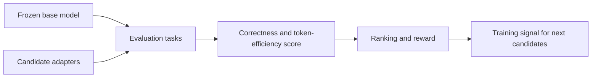
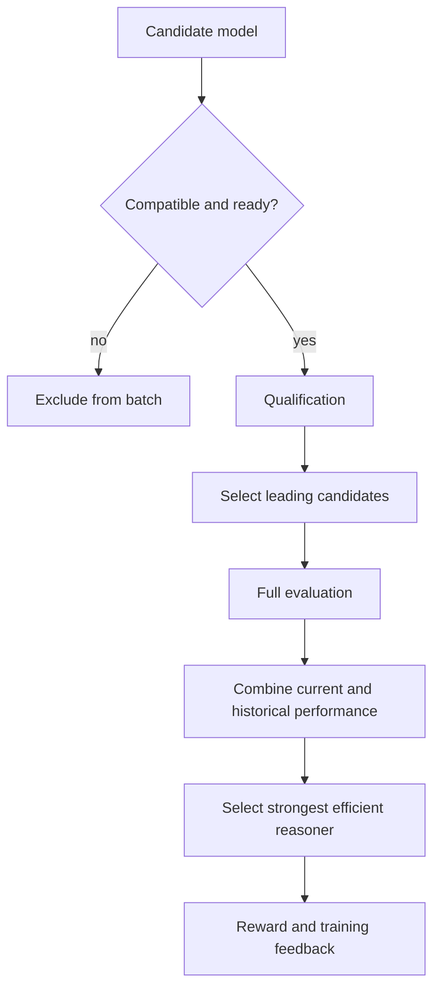

# Thinker: Evaluating Efficient Reasoning Models

## Abstract

Thinker is an evaluation-driven system for improving the reasoning efficiency
of language models. Participants train compact adaptations of a shared base
model, and the network compares those candidates on tasks that require math,
long-context understanding, and multiple-choice reasoning.

The central objective is not simply higher benchmark accuracy. Thinker rewards
models that preserve or improve answer quality while using fewer reasoning
tokens. The frozen base model provides a common reference point: each candidate
is judged by whether it improves on that baseline, where it fails, and how much
reasoning it spends to reach correct answers.

The evaluation process combines a lower-cost qualification stage with a broader
full evaluation. Correctness is scored first, efficiency is rewarded only after
correctness is established, and performance is balanced across task families so
that a model cannot win by overfitting to one narrow style of problem.

## 1. Vision

Thinker's central AI goal is to train models that think less without becoming
less capable. Modern reasoning models often improve accuracy by producing long
chains of thought, but longer reasoning traces increase latency, inference
cost, and deployment friction. More thinking is not always better thinking.

Thinker encourages models to move toward a better efficiency frontier: maintain
the answer quality of a strong reasoning model, or improve it, while using fewer
tokens to reach the answer. "Think less" does not mean guessing or skipping
necessary work. Incorrect answers are penalized first; conciseness matters only
when the model remains correct.

Through repeated training and evaluation, candidate adapters teach the shared
base model when extended reasoning is useful and when a shorter path is enough.
The desired outcome is a model that remains capable on difficult math,
long-context, and reasoning tasks while responding faster and using less
compute.

Thinker is built around four principles:

1. **Preserve capability.** Efficiency gains must not come from sacrificing
   correctness or avoiding difficult problems.
2. **Reduce unnecessary reasoning.** Among correct models, prefer the one that
   reaches the answer with fewer completion tokens.
3. **Generalize across reasoning tasks.** Improvements should hold across math,
   long-context understanding, and multiple-choice reasoning rather than one
   narrow benchmark.
4. **Learn through competition.** Continuous training and evaluator feedback
   push candidate models toward better quality per unit of inference
   compute.

## 2. Evaluation Setting

Thinker frames model improvement as a repeated evaluation loop. A frozen base
model defines the reference behavior, candidate adapters propose improvements,
and evaluators estimate which candidate provides the best quality-per-token
tradeoff on fresh reasoning tasks.

| Component | Evaluation role |
| --- | --- |
| Base model | Provides the reference answer quality and token budget. |
| Candidate adapter | Attempts to improve the base model's reasoning behavior. |
| Evaluator | Runs task batches, verifies answers, and computes rewards. |
| Task mixture | Tests math, long-context understanding, and multiple-choice reasoning. |
| Reward signal | Favors correct, shorter reasoning over incorrect or unnecessarily long answers. |

This framing keeps the AI target explicit: Thinker is selecting for models that
solve hard problems reliably and economically, not for models that merely
produce longer reasoning traces.



## 3. Evaluation Loop

Each round follows a simple model-evaluation loop:

1. A participant trains a compact adapter for the shared base model.
2. The adapter is checked for compatibility with the evaluation environment.
3. A qualification stage quickly filters for promising candidates.
4. A full evaluation compares the leading candidates against the frozen base
   model on a broader task mix.
5. Scores are balanced across task families and smoothed with recent compatible
   results where available.
6. The highest-scoring candidate becomes the round's reference winner.

This loop is designed to create a useful learning signal. A candidate that is
accurate but verbose can lose to a candidate that is equally accurate and more
efficient. A candidate that is short but wrong is penalized. A candidate that
only improves on one task family must still survive the balanced aggregate
score.

## 4. Candidate Models

### 4.1 Adaptation target

Candidates are compact LoRA adapters for the shared base model. This
keeps evaluation focused on how the adapter changes reasoning behavior rather
than on differences in base-model scale, tokenizer, or architecture.

The adapter format is intentionally constrained. Candidate models must target
the expected base model, use supported LoRA settings, and remain within
reasonable size and rank limits. This keeps evaluation comparable and prevents
unsupported model packages from affecting the scoring process.

### 4.2 Evaluation readiness

New or replacement candidates wait through a short maturity period before they
are evaluated. This keeps the comparison focused on stable model behavior
rather than transient candidate changes.

Evaluators also reject incompatible or duplicated adapters before inference.
These checks are not part of the AI reward itself; they keep the comparison set
clean so the evaluation signal reflects model quality rather than malformed
candidate artifacts.

### 4.3 Desired model behavior

The best candidate is not simply the one that answers fastest. It must remain
correct on difficult reasoning tasks, avoid unnecessary verbosity, and
generalize across the full task mixture. Thinker therefore rewards adapters
that make the base model more selective about when to reason at length.

## 5. Evaluation Design

### 5.1 Qualification

Qualification is a lower-cost evaluation applied to accepted models. By
default, it uses 25 multiple-choice reasoning problems. Five allow the model to
reason before answering, while twenty require a direct answer.

Qualification ranks the available candidates. The top candidates advance to full
evaluation, and recent champions may remain eligible so that one unusually
difficult qualification batch does not immediately remove a strong model.

### 5.2 Full evaluation

Full evaluation uses a broader reasoning workload. The current defaults are:

- 20 generated math problems; and
- 50 retrieval-backed long-context question-answering problems.

Long-context problems are open-answer tasks for the validator, but candidates
do not answer them directly. A candidate must search once, receives indexed
retrieval results labeled by one-based retrieval rank (`Doc 1`, `Doc 2`, and so
on), and must return the smallest sufficient set of evidence ranks as a final
`\boxed{indices}` selection such as `\boxed{2,5}`. Nothing may follow the final
box. The frozen original model, with
thinking disabled, then answers the question using only those selected
documents. The validator compares that answer with the gold answer, using
normalized exact match first and the same no-thinking original model as a
semantic-equivalence judge only when exact match fails.

Generated questions are accepted only when searching BM25 with the question
verbatim returns none of the seed evidence documents in the top five. Rejected
candidates are regenerated with deterministic derived seeds until every
evaluation slot is filled.

For baseline measurement, BM25 searches with the original question directly and
the frozen base model answers from the top five documents without generating a
search query or evidence selection. Baseline correctness is retained for
telemetry only. Long-context candidate rewards do not compare against baseline
completion length or correctness; they use peer-relative efficiency among
correct evidence selectors.

### 5.3 Shared and evaluator-specific problems

Each evaluation combines two types of problems:

- **Shared problems** are derived from data provided consistently to evaluators.
  They reduce large differences between evaluators caused by random batch
  difficulty.
- **Evaluator-specific problems** are generated from local randomness. They
  make the full test set less predictable and harder to overfit.

By default, half of an eligible batch is shared and half is evaluator-specific.
If shared evaluation data is temporarily unavailable, evaluators continue with
their local problem generation rather than stopping the round.



## 6. Scoring and Rewards

### 6.1 Correctness comes first

Every problem is scored by comparing the candidate with the frozen base model or
with peer candidates, depending on the task. All candidate-generated tokens
count, including private reasoning and search-tool-call tokens.

For long-context QA, the candidate is scored on evidence selection rather than
answer generation:

| Result | Exact reward |
| --- | --- |
| Candidate does not search or does not return valid `\boxed{indices}` | `-1.0` |
| Candidate-selected evidence leads the frozen model to an incorrect answer | `-1.0` |
| Candidate-selected evidence leads the frozen model to a correct answer | Bounded peer-efficiency reward from Section 6.2 |

This approach prevents short but incorrect answers from being rewarded. A model
must first solve the problem; efficiency matters only after correctness has
been established.

### 6.2 Efficiency among correct candidates

Efficiency is a bounded bonus after correctness. If the frozen base model also
solves the problem, a correct candidate is scored relative to the base model's
completion length:

```text
efficiency = clamp((T_original - T_candidate) / max(1, T_original), -0.5, 0.5)
reward     = 1.0 + 0.5 * efficiency
```

This gives correct answers a range from `0.75` to `1.25` when the base model is
already correct. A shorter correct answer can help, but a verbose correct answer
is still much better than an incorrect answer.

When the frozen base model is wrong, correct candidates are compared with other
correct candidates on the same problem. The shortest correct completion receives
the highest efficiency bonus, the longest correct completion receives no
efficiency bonus, and answers in between receive proportional bonus credit.

For correct candidates on the same problem, let `T_min` and `T_max` be the
shortest and longest completion lengths. The peer efficiency and adjusted reward
are:

```text
peer_efficiency = 1 - ((T_candidate - T_min) / (T_max - T_min))
reward          = 1.0 + 0.5 * peer_efficiency
```

If only one candidate is correct, it receives the full reward. If all correct
candidates use the same number of tokens, each receives the full peer-efficiency
reward of `1.5`. Incorrect answers are not included in this efficiency
comparison and keep their `-1.0` reward.

For example, if three correct candidates use `20`, `30`, and `50` tokens, their
rewards are:

| Completion tokens | Reward |
| ---: | ---: |
| `20` | `1.50` |
| `30` | `1.33` |
| `50` | `1.00` |

### 6.3 Balanced batch score

Problem rewards are grouped by task and difficulty before being combined. Math
problems are divided into difficulty bands, while long-context and
multiple-choice problems have their own groups. The evaluator averages within
each group and then combines the group results.

With `N_d` problems in group `d`, the group and overall scores are:

```text
group_score(d) = sum(problem rewards in d) / N_d
overall_score  = sum(group scores) / number of populated groups
```

Math uses `4` difficulty bands by default. Each populated band has equal weight
in the overall score, regardless of how many questions it contains.

This prevents a large number of easy questions from overwhelming performance on
harder or less frequent tasks. A candidate must also have enough valid results in
the required groups to remain eligible.

### 6.4 Stable ranking across rounds

Qualification and full-evaluation scores can be blended with recent compatible
results for the same model. With the current defaults, qualification ranking
uses:

```text
qualification_rank = 0.70 * current_qualification_score
                   + 0.30 * previous_full_evaluation_score
```

The top `10` qualification candidates advance by default. A new model without a
previous full-evaluation score uses its current qualification score directly.

After full evaluation, the final score is:

```text
final_score = 0.80 * current_full_evaluation_score
            + 0.20 * previous_full_evaluation_score
```

Without previous history, the current full-evaluation score is used unchanged.
For candidates that do not advance, the displayed qualification-only score is
confidence-scaled:

```text
confidence = min(1, qualification_problem_count / full_problem_count)
displayed_score = qualification_rank * confidence
```

Under the default `25` qualification and `70` full-evaluation problems,
`confidence = 25 / 70 = 0.3571`.

This reduces large ranking swings caused by one unusually easy or difficult
batch without allowing old performance to dominate new evidence.

### 6.5 Final selection signal

Thinker uses the final score to produce a clear selection signal. Among valid
full-evaluation candidates, the model with the highest final score becomes the
round champion. Other scored candidates remain visible as evaluation results,
but the strongest efficient reasoner receives the reward signal for that round.
Ties are resolved consistently so evaluators can reproduce their own decision
process.

## 7. Current Evaluation Defaults

The values below summarize the current evaluation profile and may change as the
benchmark mix evolves.

| Setting | Default |
| --- | ---: |
| Candidate maturity | 6 epochs |
| Shared portion of an eligible batch | 50% |
| Qualification multiple-choice problems | 25 |
| Qualification problems with thinking | 5 |
| Full-evaluation math problems | 20 |
| Full-evaluation long-context problems | 50 |
| Qualification candidates advancing | 10 |
| Math difficulty bands | 4 |

## 8. Conclusion

Thinker provides an evaluation framework for reasoning-model improvements. It
focuses the optimization target on a practical question: which model preserves
or improves reasoning quality while spending fewer tokens?

The evaluation system rewards more than raw accuracy. It measures improvement
over a shared base model, recognizes efficient correct reasoning, balances
performance across problem groups, and uses historical results to reduce noise.
Qualification controls evaluation cost, and full evaluation determines a clear
round champion for the reward signal.

The result is a practical framework for encouraging useful reasoning advances
while keeping the evaluation process clear, repeatable, and aligned with
real-world inference efficiency.
